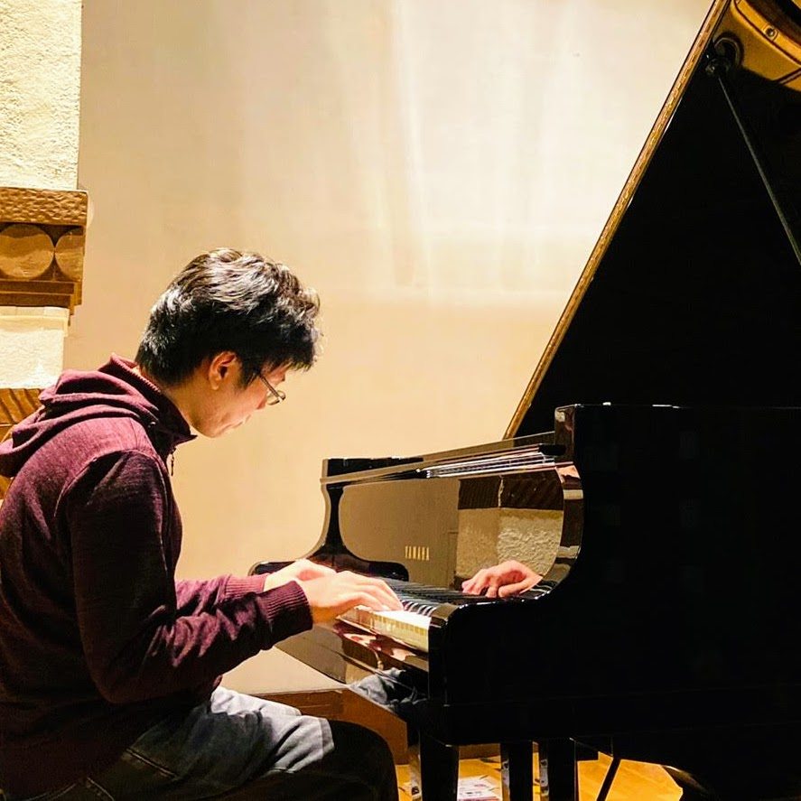

# 柴田 健一 / Kenichi Shibata
玉川大学 工学部 ソフトウェアサイエンス学科 講師 / 理化学研究所 AIP 客員研究員

---

## Research Interest
- **Personal Data & Personal AI**（分散PDS、同意とガバナンス、個人最適化）
- **Graph-Document**（知識構造化、協働編集、RAG入出力設計）
- **Learning Support**（大学教育・社会人学び直し、評価設計）
- **Multimodal/Observational Sensing**（高齢社会・医療・生活文脈の計測）
- **Human-Computer Interaction / Web & Service Informatics**

---

## Approach
- データの本人主権と説明可能性を軸に、**現場実装までの一連の流れ**（設計→試作→評価）を意識。  
- 文書・知識を**グラフとして扱う**ことで、理解と再利用性の両立を狙う。  
- 高齢社会の課題にデータ×UXで取り組み、**小さな実証の積み上げ**を重視。  

---

<h2 style="color:#2c3e50; background:#f0f0f0; padding:0.5em; border-radius:8px;">
# AI研究開発/AI Research & Development
</h2>

### 株式会社HEROICとの共同研究
**人的資本可視化のためのマルチモーダルセンシング情報を用いたエンゲージメント評価に関する研究**

企業の競争力・持続成長の源泉である「人的資本」のエンゲージメントを、生体情報・行動データ・環境データなどのマルチモーダルセンシング情報から定量的に評価する手法を開発。評価結果を企業の人材戦略・投資判断に活用する新しいフレームワークの構築を目指す。

---

### 玉川学園サンゴ研究部との連携によるサンゴ養殖支援サービスアプリの開発
- **目的**: 新入部員や学生がサンゴの飼育・養殖活動を理解しやすくするための教育支援。  
- **AI実装技術**:  
  - 飼育過程を直感的に学べる **アニメーション生成AI** を活用  
  - 長文テキストを素材にした **音声ポッドキャスト生成** により、学習スタイルに応じた情報アクセスを提供  
  - **対話型AI** による質疑応答サポートで、学生の自主的な学習を支援。  

---

### <a href="https://www.geidai.ac.jp/news/20260326156923.html" target="_blank">東京藝術大学 × 萩 × 筑波技術大学 × 玉川大学「さわるかたち みるかたち」展</a>（2026）
地域中核事業 J-PEAKS「視覚・聴覚障がい × AI × アート」の一環として、萩・明倫学舎（山口県）にて開催された展覧会に協力者として参画。3Dプリント・センシング技術を用いた触れる造形体験を通じ、萩焼の新たな可能性と多様な人々のつながりを探るプロジェクト。東京藝術大学・株式会社CASA・牧野窯・株式会社アイズ・筑波技術大学との共同実施（2026.3.29〜4.29）。

---

### ゲームセンター企業との連携アプリ
- **目的**: ゲームセンター利用者がトラブルに直面した際、迅速に問題解決を図れる仕組みを提供。  
- **AI実装技術**:  
  - 店舗に掲示した QR コードを読み取り、LINE を通じて AI にアクセス  
  - ChatGPT を用いたトラブルシューティング対話を実現  
- **特徴**: 現場スタッフへの負担を軽減しつつ、ユーザの満足度を高めるソリューションを設計。  

---

### 企業とユーザの最適マッチングを支援する対話システム
- **技術構成**:  
  - LINE をフロントにした対話インターフェース  
  - ChatGPT / Claude を組み合わせて推論を強化  
  - Azure AI Search を用いた **RAG (Retrieval-Augmented Generation)** 実装  
- **AI実装技術**: 企業情報・ユーザ希望を文脈検索し、RAG によって適合度の高い提案を生成。  
- **意義**: 人材・サービス・製品のマッチング効率を高める仕組みを設計。  

---

### LINE公式アカウント「ものわかりの良い上司」
- **目的**: 学生や利用者の悩みに対して、気軽に相談できる AI ボットを提供。  
- **AI実装技術**: LINE を窓口に、ChatGPT を用いた自然な対話応答。  
- **特徴**: ユーザが入力した悩みを柔軟に理解し、共感的に返答するエージェントを設計。  
- **実装形態**: 公開 LINE アカウントとして配信。  

---

### パーソナルデータの分散管理技術に基づく個人最適化型支援サービス
- **開発基盤**: Flutter/Dart を利用し、iOS・Android・macOS 向けにクロスプラットフォーム展開。  
- **機能**: 個人のパーソナル情報を安全に記録・管理できるアプリを開発。  
- **AI実装技術**:  
  - ユーザー同意に基づく **データ活用ガバナンス**（アクセス制御、利用履歴の可視化）  
  - 将来的な **パーソナルAI（PAI）** としての応用を視野に設計。  

---

### 電子システムを活用した鍼灸院における筋骨格痛患者の症例データベース構築（国内共同研究）
- **目的**: 鍼灸院における症例情報を体系的に収集・蓄積し、臨床研究や教育に資する基盤を構築。  
- **AI実装技術**:  
  - 症例データベースの **設計・実装** に関与  
  - 将来的な **自然言語処理** や **症状分類AI** による解析を見据えた構造化を考慮  
  - 臨床現場での入力効率とデータの標準化に配慮したシステムデザイン。  

---

## Research Themes

### 1) Personal Data & Personal AI
分散PDSに基づく個人データ管理と、個人に専属するパーソナルAI（PAI）の検討。教育・地域文脈での運用設計や同意管理、評価方法を含む。  

**Keywords:** PDS / PAI, Data Governance, Consent, Privacy-by-Design  

---

### 2) Graph-Document for Learning & Work
グラフ文書の協働作成による**思考の可視化と再利用**。学習・研修・社内ナレッジでの構造化と、RAG入出力の品質設計。  

**Keywords:** Graph-Document, Collaborative Authoring, Critical Thinking, RAG  

---

### 3) Multimodal/Observational Sensing
音・映像・行動などの多視点観察から**状態理解と評価**を行う。現場オペレーションに馴染む**軽量計測**を志向。  

**Keywords:** Multimodal, Engagement, Aging Society, Human Factors  

---

## Selected Outputs
- **AI学会誌 2025**  
  小規模言語モデルによるパーソナル AIの展望 (人工知能)  
- **大学授業における生成AIの活用設計（査読有）2024**  
  文章生成AIを用いた授業デザインの提案・実践（玉川大学工学部紀要, 2024）  
- **NCSP 2023**  
  *Collaborative Learning Support Environment Utilizing Graph Documents*（口頭発表）／同会期セッション座長  

※ 詳細は下の「Links & Records」の researchmap へ。  

---

## Teaching / Service（抜粋）
- 玉川大学：卒業研究、実験・演習系科目ほか  
- 学会活動：情報処理学会・人工知能学会・ヒューマンインタフェース学会 等  

---

## 音楽活動 / Music Activities

**brightwaltz**（ブライトワルツ）名義で 2010 年より活動するピアニスト・作曲家。ピアノ即興をベースに、ジャズ・ポップス・クラシックを横断したスタイルで作曲・演奏を行う。フリー BGM サイト <a href="https://dova-s.jp/creator/detail/81" target="_blank">DOVA-SYNDROME</a> に累計 65 曲を公開し、映像・ゲーム・イベント等で広く利用されている。

### 主な活動領域

**メディアアート・プロジェクトへの楽曲提供**
落合陽一氏の映像作品（筑波大学デジタルネイチャー研究室・個展「<a href="https://www.youtube.com/watch?v=98VGJzv7xlc" target="_blank">未知への追憶</a>」・<a href="https://www.youtube.com/watch?v=hE2CStcAO8o" target="_blank">県北芸術祭</a>（楽曲: <a href="https://dova-s.jp/bgm/play2115.html" target="_blank">Forest of Conifer Trees</a>）等）や、<a href="https://www.youtube.com/watch?v=slKkMmgJ1HY" target="_blank">大阪・関西万博テーマ事業「いのちの輝きプロジェクト」</a>（落合陽一プロデュース）へ楽曲を提供。

**公共機関・自治体コンテンツへの楽曲提供**
<a href="https://www.youtube.com/watch?v=XeKHCGbArYI" target="_blank">環境省・佐渡自然保護官事務所</a> のトキ野生復帰映像（日・英両版）、新潟県公式チャンネル「<a href="https://www.youtube.com/watch?v=h37s0PBu4AE" target="_blank">佐渡棚田紀行</a>」、<a href="https://www.youtube.com/watch?v=mprRYj43jGg" target="_blank">大分県立美術館の展覧会映像</a>など、行政・公立文化施設の公式コンテンツで採用。

**ゲーム・映像作品への楽曲提供**
人気ゲーム作品「<a href="https://dic.pixiv.net/a/%E6%AE%BA%E6%88%AE%E3%81%AE%E5%A4%A9%E4%BD%BF#h2_3" target="_blank">殺戮の天使</a>」、インディゲーム「<a href="https://life0.info/dreaminher/index" target="_blank">Dreamin' Her</a>」へのBGM提供。映画「<a href="http://www.fidff.com/com/2016-130.html" target="_blank">あかいあかい青りんご</a>」EDテーマ、短編映画「Reポエム」音楽担当など、映像・ゲーム分野での商業実績多数。

**XR・現代アート作品との協働**
<a href="https://www.tactus.jp/nox" target="_blank">Rio Nakada "NOX"</a>（XR作品, 2025）、短編映画 <a href="https://signsoflife.tokyo/news/article/1002/" target="_blank">SIGNS OF LIFE™</a>（2024）など、先端的な表現領域での音楽担当実績。

**ライブ演奏・サブスク配信**
銀座の音楽ホール <a href="https://ginzatact.com/detail.php?id=202505_022" target="_blank">GINZA TACT</a> でのライブ出演（2025）、立川 燦燦 Illumination 記念コンサート（2021）など。線香花美「<a href="https://www.youtube.com/watch?v=d8Z2rtXotro" target="_blank">物語はいつか誰かの役に立つ</a>」（作曲担当）は各種サブスクで配信中。

詳細は <a href="https://brightwaltz.mystrikingly.com/#portfolio" target="_blank">個人サイト（Music Portfolio）</a> / <a href="https://soundcloud.com/brightwaltz" target="_blank">SoundCloud</a> を参照。

---

## クラウドファンディング/Crowdfunding

### <a href="https://camp-fire.jp/projects/703754/view" target="_blank">電子カルテシステムを活用した鍼灸院における筋骨格痛患者の症例データベース構築</a>（国内共同研究・クラウドファンディングによる実施）
- **目的**: 鍼灸院での筋骨格痛患者の症例を電子カルテで多施設にわたって収集し、臨床エビデンスを蓄積・発信できる研究基盤を構築。  
- **資金調達／支援実績**:  
  - 目標金額 ¥300,000 を大きく上回る **¥1,395,289** を **240 名の支援** によって獲得（465% 達成）  
- **実施時点での成果**:  
  - 約10施設での試験的な症例集積が可能なシステム整備を実施、電子カルテの運用準備完了  
  - 全日本鍼灸学会等での中間報告・学術発表を実施、現場でのフィードバックを得ながら進行中  
- **AI実装技術**:  
  - 自然言語処理・症状分類 AI・効果予測モデルのために、症例データを AI 利用可能な形で設計  
  - 電子カルテへの入力効率化、データ標準化により品質の良いデータを集める基盤づくり  

---

### <a href="https://camp-fire.jp/projects/610230/view" target="_blank">「うつ病、パニック障害、双極性障害の体験を歌にして届けたい！」</a>（個人／アート・クラウドファンディングプロジェクト）
- **目的**: 精神疾患の当事者としてのリカバリーストーリーを歌にして制作・発信し、メンタルヘルスに関する理解と共感を促す。  
- **資金調達／支援実績**:  
  - 目標金額 ¥300,000 を設定し、 **支援総額 ¥421,780（140%）** を **79 人の支援** によって達成。  
- **成果**:  
  - 作詞・作曲・レコーディング・ミキシング等、楽曲制作を行い、先行配信・リターン品（楽曲データ、イベント招待、カセットテープなど）を実施  
  - 音楽を通じて、当事者の体験が「誰かの役に立つ物語」として発信されることを目的としたアート／社会表現として機能  

---

## Links & Records
- <a href="https://researchmap.jp/brightwaltz" target="_blank">researchmap（研究者情報）</a>  
- <a href="https://brightwaltz.mystrikingly.com" target="_blank">Strikingly（個人サイト）</a>  
- <a href="https://www.wantedly.com/id/brightwaltz" target="_blank">Wantedly（プロフィール）</a>  

---

## Contact
研究・教育・社会実装に関するご相談は、<a href="https://brightwaltz.mystrikingly.com/#contact" target="_blank">個人サイト</a>から。
